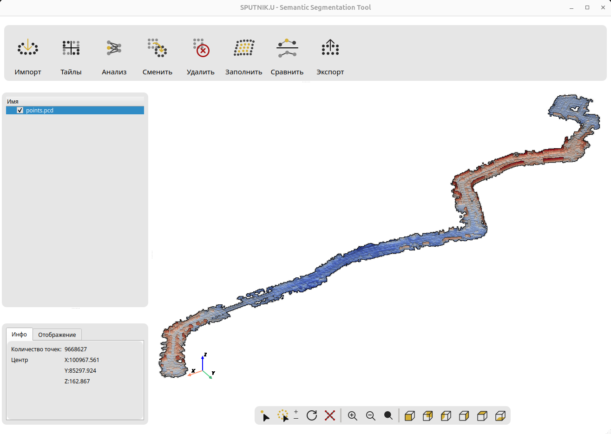

# PCD Viewer - Инструмент для семантической сегментации облаков точек

Приложение для визуализации и анализа облаков точек с использованием нейросетевых моделей семантической сегментации.



## Описание проекта

PCD Viewer - это desktop-приложение с графическим интерфейсом для работы с облаками точек (point clouds). Приложение позволяет:

- **Импортировать** облака точек в форматах `.pcd`, `.ply`, `.bin`
- **Визуализировать** 3D данные с различными режимами отображения
- **Анализировать** облака точек с помощью нейросетевых моделей (RandLA-Net)
- **Редактировать** результаты сегментации вручную
- **Сравнивать** облака точек (тепловые карты различий)
- **Разбивать** на тайлы для обработки больших сценариев
- **Экспортировать** обработанные данные

## Возможности

### Визуализация
- Различные режимы окраски: градиент по высоте, RGB, интенсивность, классы сегментации, distance (сравнение)
- Настройка размера точек, цвета фона, режима проекции
- Eye Dome Lighting для лучшего восприятия глубины
- Стандартные виды (спереди, сзади, сверху, снизу, слева, справа)
- Управляемый colorbar для режима сравнения

### Сегментация
Приложение включает четыре предобученные модели RandLA-Net:

1. **RandLA-Net (Hack2C)** - 2 класса: Background, Car
2. **RandLA-Net (Toronto3D)** - 8 классов: Road, Road marking, Natural, Building, Utility line, Pole, Car, Fence
3. **RandLA-Net (SemanticKITTI)** - 19 классов дорожной сцены
4. **RandLA-Net (Lidar Scenes)** - 4 класса: Background, Car, Person, Tram (с поддержкой intensity)

### Редактирование
- Ручное выделение точек (точечное и кистью с регулируемым размером)
- Изменение класса выделенных точек через диалог
- Удаление точек по классам через диалог
- Интерполяция областей с настройкой плотности и уровня шума
- Автоматический сброс выделения после операций

### Сравнение облаков
- **Тепловая карта расстояний** (Distance Heatmap) - градиентная визуализация от синего до красного
- **Только различия** (Show Differences) - отображение точек с расстоянием больше порога
- **Статистика** (Statistics) - метрики сравнения (среднее, медиана, максимум)
- **Два режима colorbar**: градиентный (плавный) или бинарный (синий/красный по порогу)
- Настраиваемый порог различий (0.01-10.0 м)

### Работа с тайлами
- **Разбиение на тайлы** - деление больших облаков на управляемые части
  - Настраиваемый размер тайла (1-1000 м)
  - Процент перекрытия (0-50%)
  - Сохранение всех атрибутов (классы, интенсивность)
- **Управление группами тайлов** - показ/скрытие целой группы или отдельных тайлов
- **Объединение тайлов** - слияние обратно в единое облако с опцией удаления исходных

## Структура проекта

```
hackathon/
├── README.md              # Этот файл
├── interface.png          # Скриншот интерфейса
├── requirements.txt       # Зависимости Python
├── run.py                # Скрипт запуска приложения
├── ui/                   # Исходный код приложения
│   ├── MainWindow.py     # Сгенерированный UI код
│   ├── PCDViewer.py      # Основная логика приложения
│   └── icon/             # Иконки интерфейса
├── configs/              # Конфигурации моделей
│   ├── randlanet_hack2c.yml
│   ├── randlanet_toronto3d.yml
│   ├── randlanet_semantickitti.yml
│   └── randlanet_lidar_scenes.yml
├── models/               # Веса нейросетей
│   ├── randlanet_hack2c.pth (2 класса)
│   ├── randlanet_toronto3d.pth (8 классов)
│   ├── randlanet_semantickitti.pth (19 классов)
│   └── randlanet_lidar_scenes.pth (4 класса)
└── data/                 # Пример данных
    └── points.pcd
```

## Требования

### Системные требования
- **OS**: Linux (рекомендуется Ubuntu 20.04+)
- **Python**: 3.10.8 (строго рекомендуется)
- **GPU**: NVIDIA GPU с поддержкой CUDA (рекомендуется для инференса)
- **RAM**: минимум 8 GB
- **Диск**: ~2 GB для моделей и зависимостей

### Программные зависимости
Основные библиотеки:
- PyQt5 - графический интерфейс
- PyVista - 3D визуализация
- Open3D - работа с облаками точек
- PyTorch - нейросетевой инференс
- NumPy, SciPy - вычисления

Полный список см. в `requirements.txt`

**Важно**: Проект использует Open3D-ML для нейросетевых моделей. Этот модуль устанавливается автоматически из GitHub при выполнении `pip install -r requirements.txt`.

## Установка

### 1. Клонирование/распаковка проекта

```bash
# Если это архив, распакуйте его:
# unzip hackathon.zip
# cd hackathon

# Или клонируйте репозиторий:
git clone <repository_url>
cd hackathon
```

### 2. Создание виртуального окружения

Рекомендуется использовать виртуальное окружение Python:

```bash
# Создание виртуального окружения
python3 -m venv venv

# Активация виртуального окружения
source venv/bin/activate
```

### 3. Установка зависимостей

#### Вариант A: С поддержкой CUDA (рекомендуется)

Если у вас есть NVIDIA GPU и установлена CUDA:

```bash
# Установка PyTorch 2.2.2 с CUDA 11.8 (требуется для Open3D-ML!)
pip install torch==2.2.2 torchvision==0.17.2 torchaudio==2.2.2 --index-url https://download.pytorch.org/whl/cu118

# Установка остальных зависимостей
pip install -r requirements.txt
```

#### Вариант B: Только CPU

Если GPU нет или CUDA не установлена:

```bash
# Установка PyTorch 2.2.2 CPU-версии (требуется для Open3D-ML!)
pip install torch==2.2.2 torchvision==0.17.2 torchaudio==2.2.2 --index-url https://download.pytorch.org/whl/cpu

# Установка остальных зависимостей
pip install -r requirements.txt
```

**Примечание**: На CPU инференс будет значительно медленнее (несколько минут на облако).

### 4. Проверка установки

Сначала проверьте версию Python:

```bash
python3 --version
# Должна быть: Python 3.10.8
```

Затем проверьте, что все основные модули импортируются:

```bash
python3 -c "import torch; import open3d; import pyvista; print('OK')"
```

Если команда вывела `OK`, установка прошла успешно.

## Запуск приложения

### Базовый запуск

```bash
# Убедитесь, что виртуальное окружение активировано
source venv/bin/activate

# Запуск приложения
python3 run.py
```

### Первый запуск

При первом запуске:
1. Откроется главное окно приложения
2. Нажмите кнопку **"Импорт"** в левой панели
3. Выберите файл облака точек (например, `data/points.pcd`)
4. Облако отобразится в 3D-окне

## Использование

### Импорт облака точек

1. Кнопка **"Импорт"** → выбрать файл `.pcd`, `.ply` или `.bin`
2. Облако появится в списке слева и отобразится в 3D-окне

### Анализ нейросетью

1. Выберите облако в списке (левая панель)
2. Нажмите кнопку **"Анализ"**
3. В открывшемся диалоге выберите модель:
   - **RandLA-Net (Hack2C)** - для детекции автомобилей (2 класса)
   - **RandLA-Net (Toronto3D)** - для городских сцен (8 классов)
   - **RandLA-Net (SemanticKITTI)** - для дорожных сцен (19 классов)
   - **RandLA-Net (Lidar Scenes)** - для городских сцен с транспортом (4 класса, требует intensity)
4. Нажмите **"Запустить анализ"**
5. Дождитесь окончания инференса (10-60 секунд в зависимости от размера облака и GPU)
6. Результат отобразится цветами классов

**Важно**: Модель **Lidar Scenes** требует наличия атрибута `intensity` в облаке точек для корректной работы.

### Визуализация

**Режимы окраски** (правая панель, выпадающий список):
- **Градиент по высоте** - от синего (низ) к красному (верх)
- **RGB** - исходные цвета (если есть)
- **Интенсивность** - интенсивность отражения лазера
- **Label** - аннотированные классы
- **Predict** - результат нейросети
- **Distance** - расстояния при сравнении облаков (с colorbar)
- Одноцветные: Белый, Черный, Синий, Серый

**Управление камерой**:
- **Левая кнопка мыши** - вращение
- **Средняя кнопка мыши** - панорама
- **Колесико мыши** - масштабирование
- Кнопки **Спереди/Сзади/Слева/Справа/Сверху/Снизу** - стандартные виды
- **Сброс вида** - сброс камеры и показ всей сцены
- **Зум +/-** - увеличение/уменьшение масштаба

### Редактирование

**Выделение точек**:
- Кнопка **"Выбор"** - режим точечного выделения (правая кнопка мыши по точке)
- Кнопка **"Кисть"** - режим выделения кистью (правая кнопка мыши, Alt+ПКМ для снятия)
- Кнопки **+/-** - увеличение/уменьшение размера кисти (1-20)

**Операции с точками**:
- **"Сменить класс"** - открывает диалог выбора класса для преобразования выделенных точек
- **"Удалить класс"** - открывает диалог выбора класса для удаления всех его точек
- **"Сброс выбора"** - очистить текущее выделение
- **"Удалить выбор"** - удалить выделенные точки
- **"Заполнить"** - интерполяция области по выделенным граничным точкам
  - Настройка коэффициента разреженности (1.0-10.0)
  - Настройка уровня шума (0.0-1.0)

**Контекстное меню** (правая кнопка на облаке в списке):
- Очистить выделение
- Удалить выделенные точки
- Интерполировать область (beta)
- Удалить облако

### Сравнение облаков

1. Нажмите кнопку **"Сравнить"**
2. В диалоге выберите:
   - **Исходное облако** - базовое облако для сравнения
   - **Сравнить с** - второе облако
   - **Режим сравнения**:
     - Distance Heatmap - тепловая карта всех расстояний
     - Show Differences - только точки с расстоянием > порога
     - Statistics - статистика + карта
   - **Порог различий** (0.01-10.0 м) - для фильтрации малых изменений
   - **Тип colorbar**:
     - Gradient - плавный градиент (синий→зеленый→желтый→красный)
     - Binary - два цвета по порогу (синий ≤ порог, красный > порог)
3. Нажмите **"Сравнить"**
4. Результат сохранится как новое облако с именем `{source}_vs_{target}_heatmap/diff`

**Управление colorbar**:
- Colorbar отображается только когда облако сравнения видимо
- При переключении на режим Distance - colorbar появляется автоматически
- При переключении на другой режим - colorbar скрывается

### Работа с тайлами

**Разбиение на тайлы**:
1. Выберите облако в списке
2. Нажмите кнопку **"Тайлы"**
3. В диалоге укажите:
   - **Размер тайла** (1-1000 м) - размер одного тайла
   - **Перекрытие** (0-50%) - процент перекрытия между тайлами
4. Нажмите **"Создать тайлы"**
5. В дереве появится группа с тайлами (можно показывать/скрывать группу или отдельные тайлы)

**Объединение тайлов**:
1. Правой кнопкой по группе тайлов → **"Объединить тайлы в облако"**
2. Подождите завершения объединения
3. В диалоге можно выбрать удаление исходных тайлов

**Удаление группы тайлов**:
- Правой кнопкой по группе тайлов → **"Удалить группу тайлов"**

### Экспорт результатов

1. Выберите облако в списке
2. Нажмите **"Экспорт"**
3. Укажите путь для сохранения файла
4. Файл сохраняется в формате `.pcd` (бинарный)

**Экспортируются все атрибуты**:
- Координаты (positions)
- Цвета (colors) - если есть
- Интенсивность (intensity) - если есть
- Аннотации (label) - если есть
- Предсказания (predict) - после инференса
- Высота (height) - вычисляется автоматически

## Технические детали

### Архитектура моделей

**RandLA-Net** (Random Sampling and Local Feature Aggregation Network):
- Эффективная архитектура для семантической сегментации больших облаков точек
- Использует random sampling для обработки миллионов точек
- Local feature aggregation для сохранения геометрических деталей
- Поддержка дополнительных каналов (intensity, RGB) для улучшения точности

**Особенности моделей**:
- **Hack2C**: 3 канала (XYZ), 2 класса, быстрый инференс
- **Toronto3D**: 6 каналов (XYZ + RGB), 8 классов, городские сцены
- **SemanticKITTI**: 4 канала (XYZ + intensity), 19 классов, дорожные сцены
- **Lidar Scenes**: 4 канала (XYZ + intensity), 4 класса, требует intensity для корректной работы

### Формат данных

Приложение работает с тремя форматами:
- **PCD** (Point Cloud Data) - формат Open3D/PCL с поддержкой атрибутов
- **PLY** (Polygon File Format) - универсальный формат
- **BIN** (KITTI Binary) - бинарный формат KITTI dataset (XYZ + intensity)

**Поддерживаемые атрибуты**:
- positions (XYZ) - обязательно
- colors (RGB) - опционально
- intensity - опционально (важно для Lidar Scenes)
- label - опционально (ground truth)
- predict - добавляется после инференса
- height - вычисляется автоматически из Z-координаты

### Производительность

Типичное время инференса (на примере GPU NVIDIA RTX 3090):
- 100K точек: ~10-15 секунд
- 500K точек: ~30-40 секунд
- 1M точек: ~60-90 секунд

**Оптимизация для больших облаков**:
- Используйте функцию разбиения на тайлы для облаков > 1M точек
- Рекомендуемый размер тайла: 50-100 м с перекрытием 10-20%
- После обработки тайлов можно объединить результаты

На CPU время увеличивается в 10-20 раз.

### Сравнение облаков

**Алгоритм**:
- Использует `open3d.geometry.PointCloud.compute_point_cloud_distance()`
- Вычисляет расстояние от каждой точки исходного облака до ближайшей точки в целевом
- Поддерживает три режима визуализации и два типа colorbar

**Применение**:
- Контроль качества после редактирования (сравнение до/после)
- Оценка изменений в сцене (мониторинг деформаций)
- Валидация результатов сегментации

## Решение проблем

### Неправильная версия Python

Убедитесь, что используется Python 3.10.8:

```bash
python3 --version
```

Если версия отличается, установите Python 3.10.8:

```bash
# Добавление репозитория deadsnakes (для Ubuntu)
sudo add-apt-repository ppa:deadsnakes/ppa
sudo apt update
sudo apt install python3.10

# Проверка версии
python3.10 --version
```

Используйте `python3.10` вместо `python3` для создания виртуального окружения:

```bash
python3.10 -m venv venv
source venv/bin/activate
```

### Ошибка "No module named 'PyQt5'"

```bash
pip install PyQt5
```

### Ошибка "Could not load OpenGL"

Убедитесь, что установлены драйверы GPU и библиотеки OpenGL:

```bash
sudo apt-get install libgl1-mesa-glx libglu1-mesa
```

### Ошибка "CUDA out of memory"

- Уменьшите размер облака точек или используйте подвыборку
- Закройте другие приложения, использующие GPU
- Используйте CPU-версию PyTorch (инференс будет медленнее)

### Инференс очень медленный

- Убедитесь, что используется GPU-версия PyTorch
- Проверьте, что CUDA работает: `python3 -c "import torch; print(torch.cuda.is_available())"`
- Если вывод `False`, переустановите PyTorch с CUDA

### Приложение не запускается

1. Проверьте версию Python: `python3 --version` (должна быть >= 3.8)
2. Проверьте, что виртуальное окружение активировано
3. Переустановите зависимости: `pip install -r requirements.txt --force-reinstall`

### Плохие результаты инференса с Lidar Scenes

**Проблема**: Модель RandLA-Net (Lidar Scenes) показывает плохие результаты сегментации.

**Решение**: 
- Убедитесь, что облако точек содержит атрибут `intensity`
- Проверьте наличие intensity: импортируйте облако и переключите режим окраски на "Интенсивность"
- Если intensity отсутствует или равна нулю - модель не будет работать корректно
- Используйте файлы в формате `.pcd` или `.bin` с intensity

### Colorbar не отображается при сравнении

**Проблема**: После сравнения облаков colorbar не виден.

**Решение**:
- Убедитесь, что облако сравнения видимо (галочка в дереве)
- Переключите режим окраски на "Distance"
- Colorbar автоматически скрывается при переключении на другие режимы

### Тайлы отображаются некорректно

**Проблема**: При создании нескольких групп тайлов, показываются не те тайлы.

**Решение**: Эта проблема исправлена в текущей версии. Каждая группа тайлов имеет уникальный ID.

### Ошибка при интерполяции области

**Проблема**: `ImportError: No module named 'scipy'`

**Решение**:
```bash
pip install scipy
```

## Changelog

### Версия 2.0 (текущая)
- ✅ Добавлена модель RandLA-Net (Lidar Scenes) с поддержкой intensity
- ✅ Реализовано сравнение облаков точек (3 режима, 2 типа colorbar)
- ✅ Добавлено разбиение на тайлы с настраиваемым перекрытием
- ✅ Реализовано объединение тайлов обратно в облако
- ✅ Улучшена интерполяция с настройками плотности и шума
- ✅ Добавлены tooltips для всех кнопок
- ✅ Автоматический сброс выделения после операций
- ✅ Диалоги выбора для анализа, трансформации и удаления классов
- ✅ Управляемый colorbar для режима Distance
- ✅ Исправлена обработка intensity для всех моделей

### Версия 1.0
- Базовая функциональность визуализации
- Три модели RandLA-Net (Hack2C, Toronto3D, SemanticKITTI)
- Ручное редактирование и выделение точек
- Импорт/экспорт облаков
